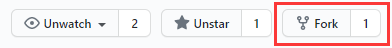
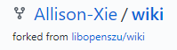
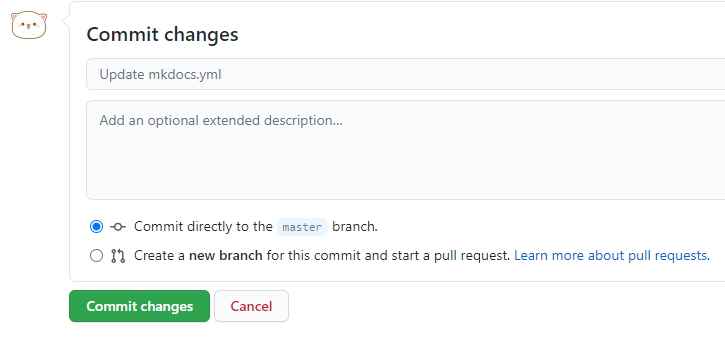
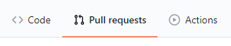
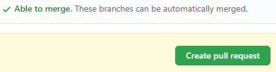

感谢您参与贡献本百科。

本文旨在为未接触过Git的同学提供一定程度上的帮助。如果您已经对Git和Markdown非常熟悉，那么您可以直接跳转至本站源码仓库参与贡献。

## 在开始之前

您需要……

+ 拥有[GitHub](https://github.com/)账号
+ 如果希望预览效果，那么请在电脑上安装[Docker](https://www.docker.com/)或是[Python](https://www.python.org/)
+ 如果希望在自己的设备上有更好的编辑体验，那么可以安装[Typora — a markdown editor, markdown reader.](https://typora.io/)

> 为什么要用Git？

想想你写论文的时候，是否经历过这样的场景？毕业论文.docx->毕业论文-1.0.docx->毕业论文-2.0最终版.docx->毕业论文-3.0打死不改版.docx->毕业论文-4.0打死不改最新版……

是的，Git是一个版本管理工具，能够轻而易举地解决这些问题，并且助力团队协作。

> 应该如何使用呢？

对于Git的基本概念，网络上已经有很多非常好的教程，您可以先在[git - 简明指南](http://rogerdudler.github.io/git-guide/index.zh.html)看到。

简言之，如果您是自己一个人在使用Git，通常需要经历：

1. 初始化一个仓库（`git init`），或是从云端检出（`git clone`）等
2. 创建文件，并使用Git追踪它们（`git add`）
3. 修改文件
4. 提交你所做出的变更（`git commit`）（重要）
5. 推送到云端（`git push`）

这样的过程。

但是……

如果您希望对不属于自己的仓库（例如本站源码）做出更改，那么需要先`fork`本项目，这会复制一份完全一样的项目到您的项目下。然后您像往常一样对这份副本进行修改，并提交变更。当您确定没有问题的时候，就可以通过`pull request`请求合并您的更改到本站源码了。

## 让我们开始吧

### 编辑已经存在的页面

这要简单得多，因为有些操作是自动完成的。

您可能已经注意到了，每个页面的标题右侧，都有一个编辑按钮。如果您发现页面中有错误、或是有想补充的内容等情况，那么您可以直接点击它。这将会带您到达编辑页面，您只需要进行编写，确定无误之后直接可以进行`pull request`请求合并。

### 新增页面或其他操作

您可以通过站点右上角进入仓库，`fork`到自己的仓库中进行修改。

此时应该能看到：

在此之后，您可以自由地进行更改，然后在确认无误之后执行提交：

等等！还没结束呢。这仅仅是更改了您刚刚复制的副本，如果您希望把您的劳动成果贡献给本项目，您还需要`pull request`！

找到它：

如果没有冲突，您就可以直接提交了：

静候好消息吧！如果您的更改被接受，那么您应该会收到GitHub发出的提示邮件，并且很快就会展示在网站上。

## 我累了，可以直接投稿吗

没有问题，请加入QQ群1141821825并说明来意吧！

## 扩展阅读

Pro Git 中文版 (第2版) [社区翻译电子版](https://www.progit.cn/) [图灵出品纸质书](https://www.ituring.com.cn/book/1608)

[GitHub Guides](https://guides.github.com/)
