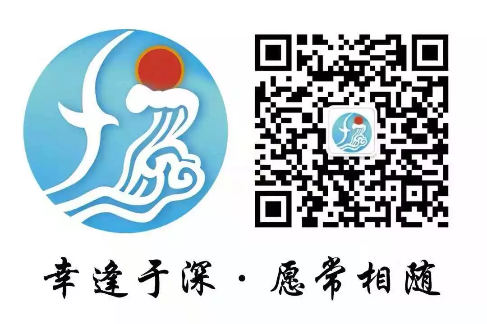

!!! info "信息"

    简介等信息转载自其公众号，已得到作者授权。

## 简介
深圳大学福建同乡会（以下简称“乡会”），一个联络与团结各闽籍深圳大学学子、教职工的组织，因为福建人团结一心的特质，在深圳大学开始对闽地招生后应运而生。三十多年来，带着勤奋务实、“爱拼才会赢”的乡风来到自由城的历届闽籍校友们团结协作，各施所能，无私地奉献自己的时间与精力，让乡会由零散随意的组织逐步成长为了成熟有型的深大闽籍人的大家庭。[^1]

## 微信公众号

[^1]: [深圳大学福建同乡会简介](https://mp.weixin.qq.com/s/eqBa-tE--YUl2NMGbTjunA)
