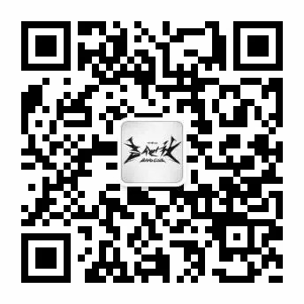

# 深大吉他社

!!! info "信息"

    本信息由社团负责人撰写，由站点维护者代为发布。一切权利归社团所有。

## 社团简介
深圳大学吉他社（Band club），建立于2002年，隶属于深大社团联合会。是由深圳大学里的一群热爱音乐，喜欢吉他的学生发起并组建的学生协会，面向整个深圳大学。始终为广大音乐爱好者提供个广阔的交流平台。使他们在课余生活中增长见识，陶冶情操。吉他社以最大的热情，服务于广大的学生，它已经成为培养和发掘音乐人才的基地，为每一位在校的音乐爱好者提供可以发挥才华的空间。

吉他社每学期都会组织组Band大会和定期的吉他教学，让更多的人学会弹吉他，让爱音乐的深大人能够组一支属于自己的乐队。

吉他社目前已经发展为由项目部、常务部、宣传部横向分工结构组成的完整的社团组织。

## 活动回顾
1. 2010.03“Rock My Way，Roll My Life”深圳高校乐队大赛
2. 2010.05 第一届深圳大学主唱大赛
3. 2010.11“Rock You，Rock Me”狂欢之夜迎新晚会
4. 2011.05 第二届深圳高校乐队大赛
5. 2012.11“末日的呐喊”狂欢之夜迎新晚会
6. 2013以吉他社为主的三社团(音乐协会.街舞协会)联合晚会
7. 2013石头坞Band Show
8. 2014.04.24 后青年校园音乐季深大站 （逃跑计划、Supper Moment、Deep Inside）
9. 2014.5.27国际演会中心不插电演唱会
10. 2014石头坞Band Show
11. 2015石头坞不插电演唱会
12. 2015.11石头坞bandshow
13. 2017.5.12 石头坞 bandshow
14. 2017.12.8 石头坞广场 “音乐虫洞”bandshow
15. 2018.12.16 吉他社band房 “墙之下”bandshow
16. 2019.12.8 吉他社band房 “野蛮生长”bandshow

## 微信公众号

