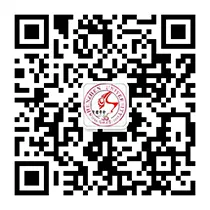

# 管协

!!! info "信息"

    本页面由工具人抓取并生成，仅作展示用途，来源于[社团介绍 | 优质社团等着你噢【深大校会】](https://mp.weixin.qq.com/s/KY_v5zTcAiI-uEHBweQAyQ)。若无意中侵犯了您的权益，请联系删除。
    
    如果您是社团的负责人，请及时编辑本条目。
    
## 社团简介
深圳大学管理学会成立于 1996 年，简称 “管学”，直属于深圳大学校团委，以宣传管理知识、举办管理类活动为主，是集理论和实践于一身学术性社团，21年来有上千会员走出社会成为各行精英。下设实践部、外联部、和形象推广部三大部门，实践部带你统筹全局，叱咤风云，为每一个活动献上完美策划；形象推广部带你用PS设计海报，重构平面世界，精通office办公软件，充实自己；外联部教你洽谈各路商家，锻炼雄辩口才，接触社会，增长见识。部门间相互合作，共同造就营销大赛、企业参访、高校交流等王牌活动的顺利举行，并在其中获得能力的提升。

## 微信公众号
名称：深大管理学会

微信号：szuglxh

### 深大管学君

