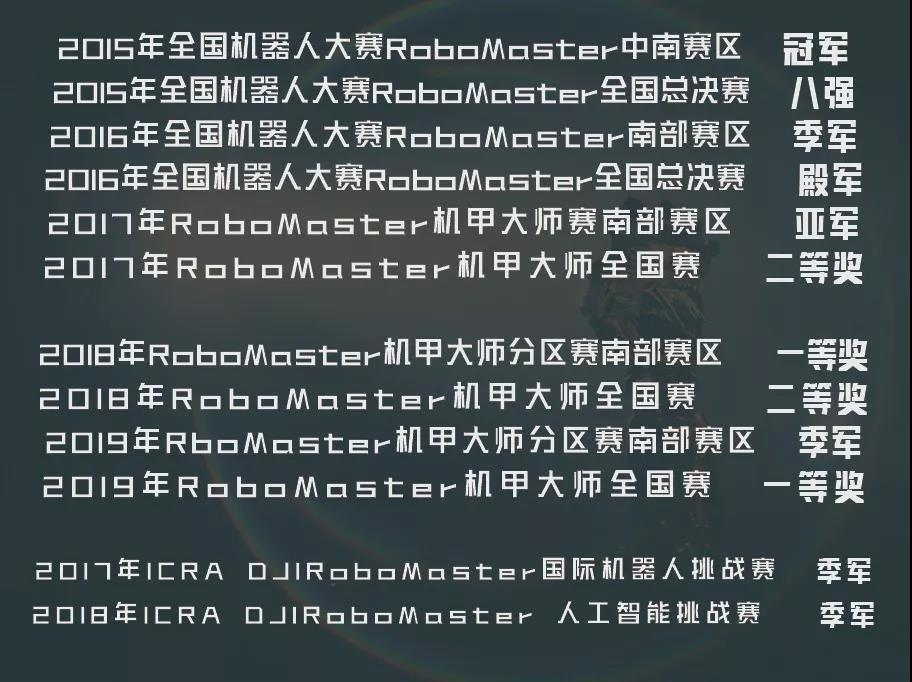
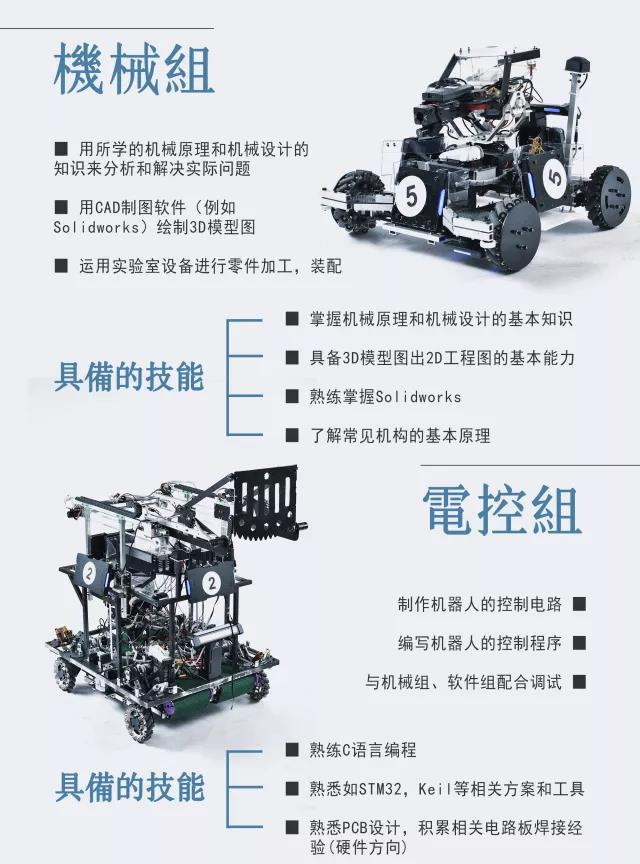
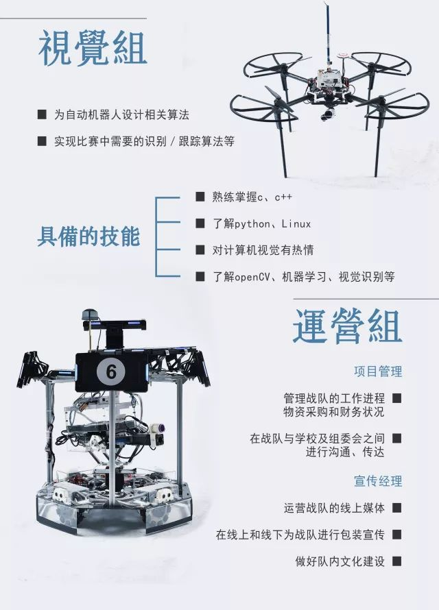
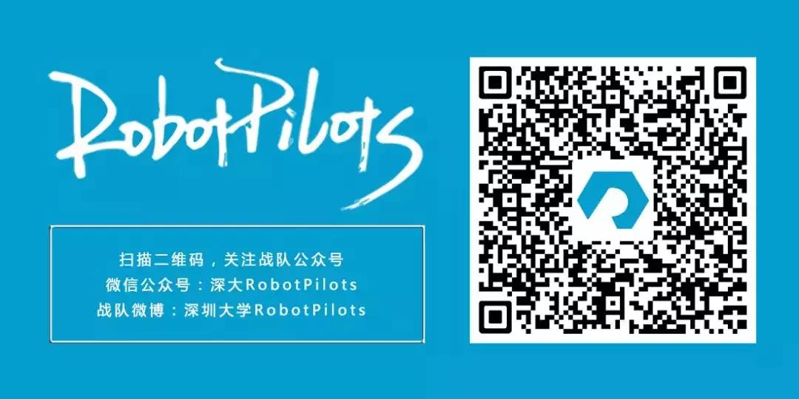

# 深大RobotPilots
## 战队简介
深大RobotPilots战队，中文名机器人领航者，寓意争当机器人比赛中的领头羊。秉承着“坦诚、极致、忘我、志远、不功利”的宗旨，RobotPilots脚踏实地，不断进取。经过几年的磨练，RobotPilots已成长为由32名队员组成的大团体，在RoboMaster全国大学生机器人大赛上过关斩将，收获累累硕果。

## 历史战绩

## 团队架构
作为一个专注于机器人的学生团队，RobotPilots战队内部分工明确，总共分成四个组：机械组、电控组、视觉组和运营组。

## 加入我们
RPers以自己的热情与才智，一步步绘制战队的宏伟蓝图，无形中散发出自身的光芒，自然吸引了许多机器人钟情者慕名而来。

从最初的九人组，到如今已发展到三十余人的强势队伍，战队历届总人数达百人。战队在校内的影响力日益扩大，RoboMaster机甲大师赛声名远扬。

