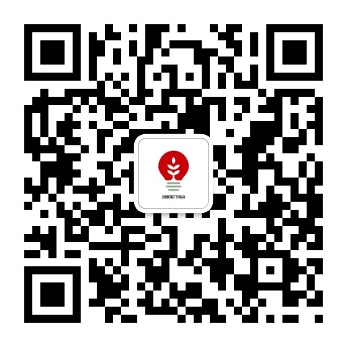
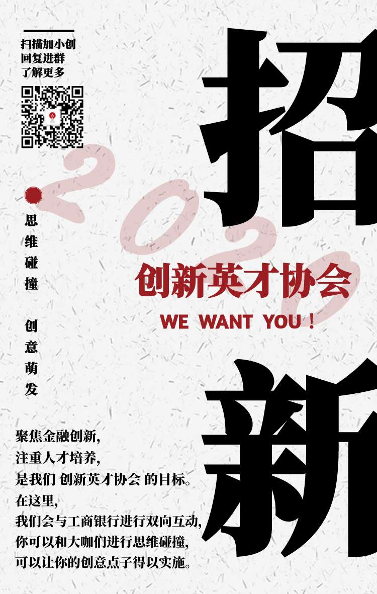
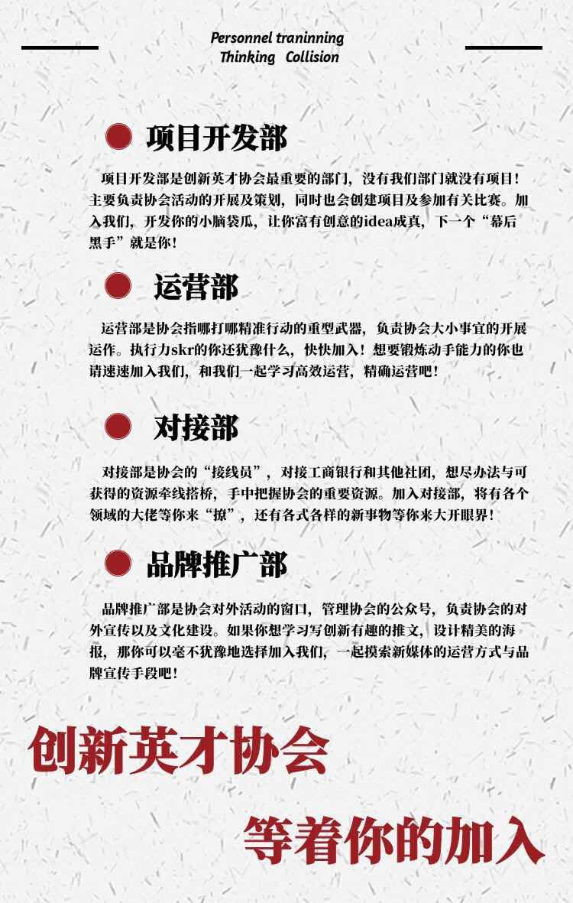
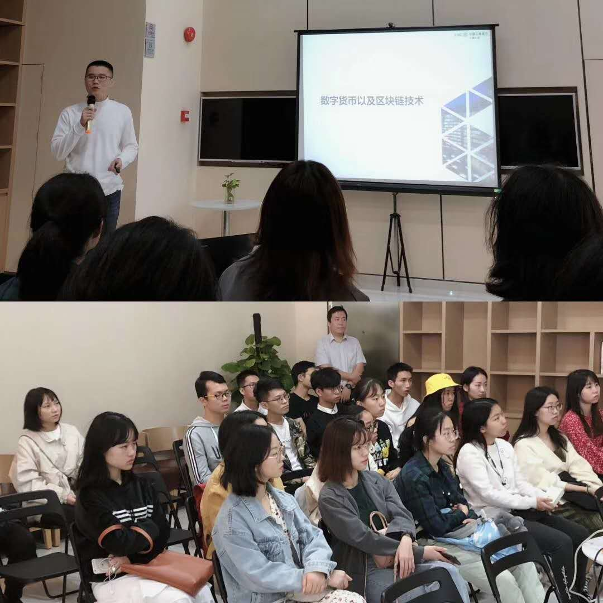
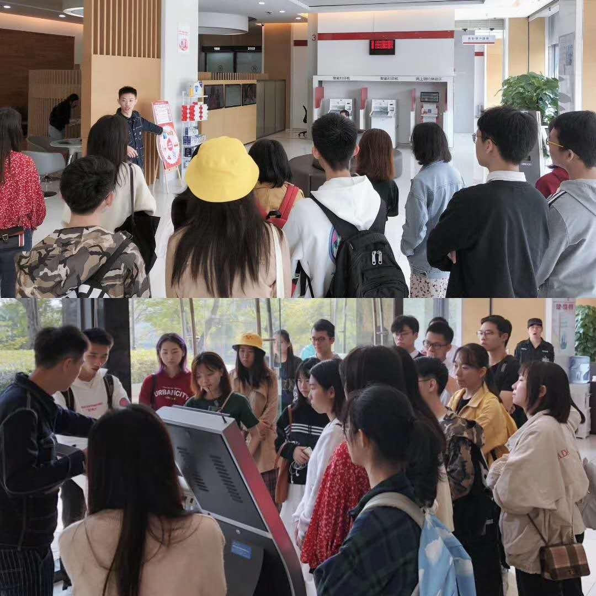
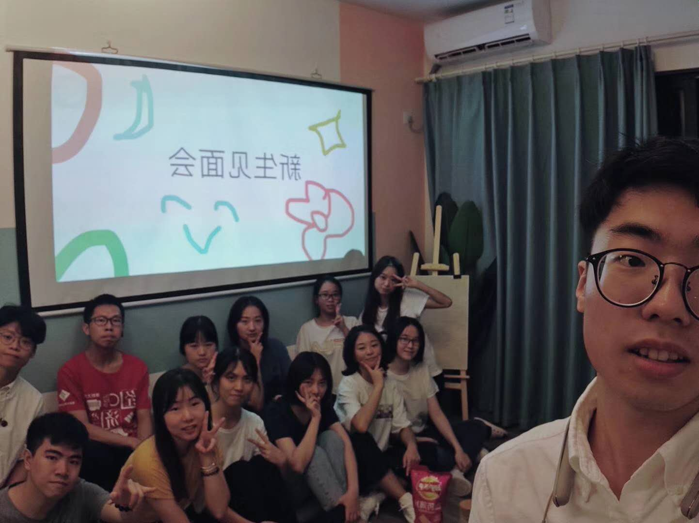
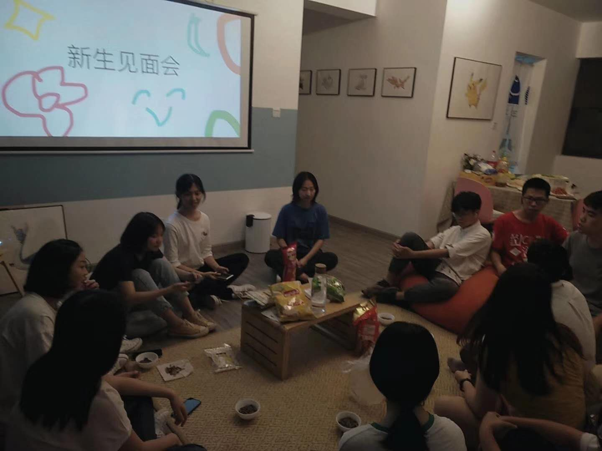
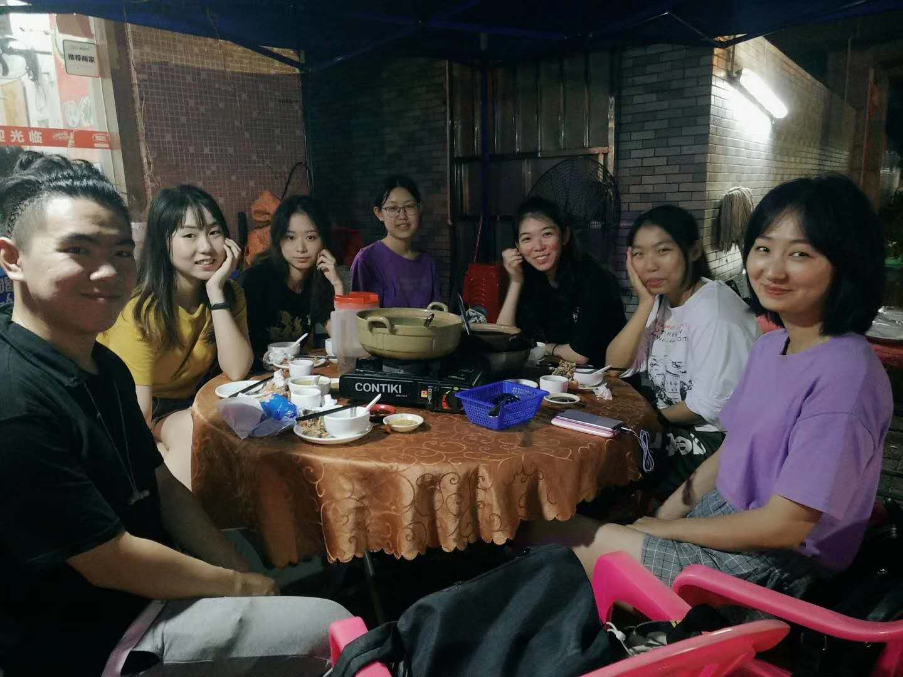
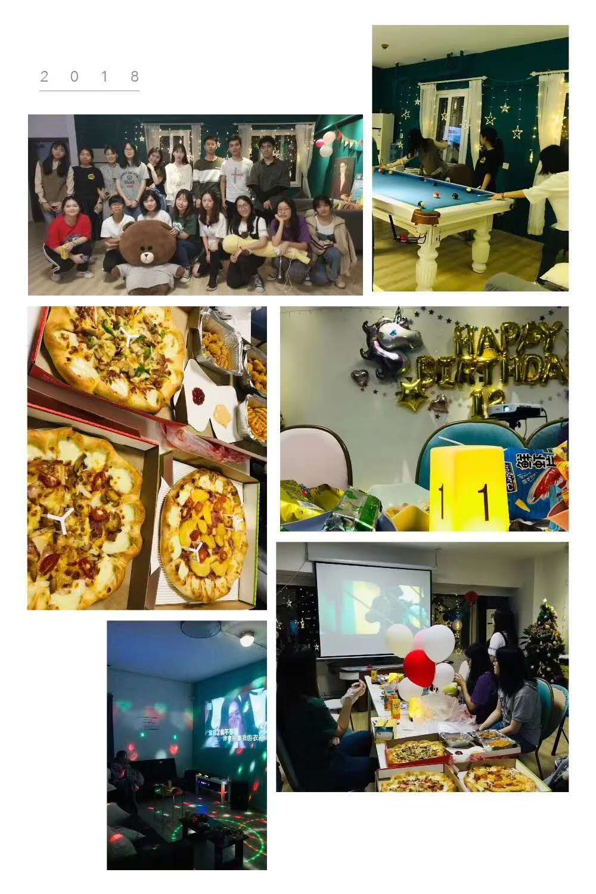

!!! info "信息"

    本信息由社团负责人撰写，由站点维护者代为发布。一切权利归社团所有。

## 社团简介
作为中国工商银行旗下的学生社团，我们会对接工商银行，举办有关金融创新的活动项目，工行为我们提供金融知识培训、企业参访、实习项目等活动支持。在这里，你可以和大咖们进行思维碰撞，可以让你的创意点子得以实施。

## 微信公众号
名称：创新英才培养计划

微信号：gh_50cb280f11dc

## 招新咨询群
{: style="max-width:360px;" }

## 海报

## 相关图片

