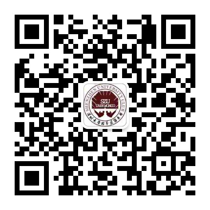
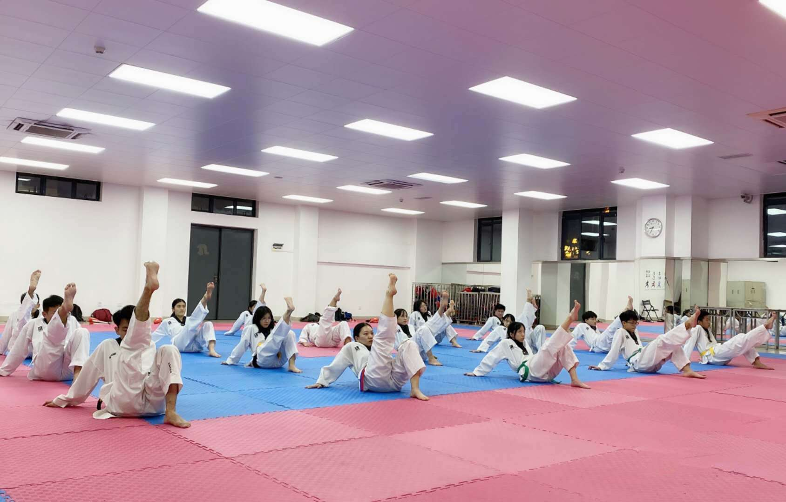
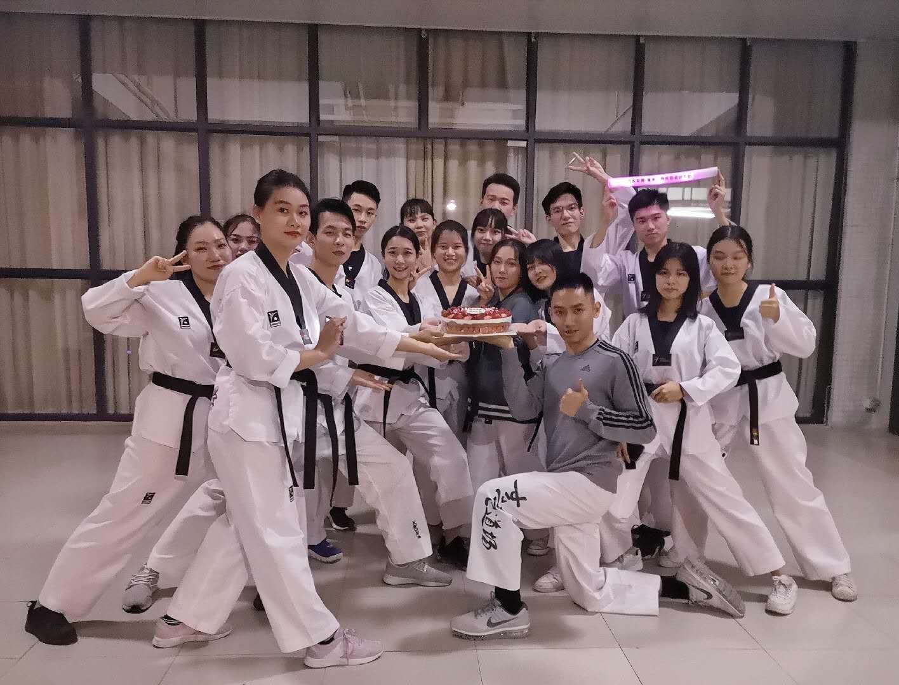

!!! info "信息"

    本信息由社团负责人撰写，由站点维护者代为发布。一切权利归社团所有。

## 社团简介
深圳大学跆拳道俱乐部是深大唯一一个跆拳道类的社团，也是深大最早成立的体育类社团之一，始创于1997年，至今已有20多年历史，为深大培养了许多跆拳道方面的人才。本部旨在为热爱跆拳道的大学生提供一个训练与职业发展相结合的大平台，面向所有深大学子提供最好的训练、健身、塑身、表演、培训与学习等诸多机会。

## 微信公众号
名称：深圳大学跆拳道俱乐部

微信号：szutkd

### 社团负责人

## 招新咨询群
{: style="max-width:360px;" }

## 相关图片
{: loading=lazy }

{: loading=lazy }

{: loading=lazy }
