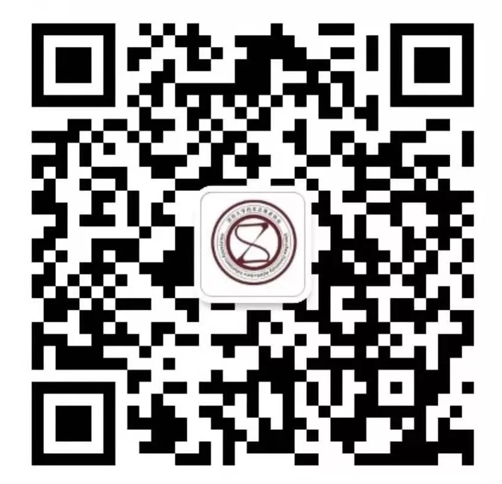

# 深大招协

!!! info "信息"

    本页面由工具人抓取并生成，仅作展示用途，来源于[社团介绍 | 优质社团等着你噢【深大校会】](https://mp.weixin.qq.com/s/KY_v5zTcAiI-uEHBweQAyQ)。若无意中侵犯了您的权益，请联系删除。
    
    如果您是社团的负责人，请及时编辑本条目。
    
## 社团简介
深圳大学招生志愿者协会隶属深圳大学招生办公室，是招生办唯一直属的校级学生组织，同时也是广东省招协联盟创始成员之一，是2018年深大十佳社团之一。致力于推动深大招生宣传，负责举办全校大型社会实践活动——“寒假返母校宣传深大”活动、明信片漂流、打包“深大盒子”等与深大招生相关的活动。深大招协2019年面向全校招新，只要你是全日制本科生，不管你是大一萌新，还是大二、大三的烙饼，只要你有一颗乐于奉献、服务的心，我们都欢迎你的加入！

## 微信公众号
### 深大招招
微信号：shendazhaoxie

