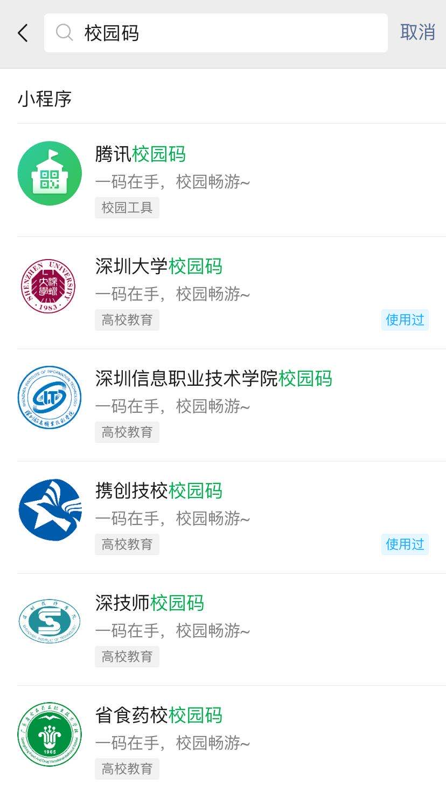
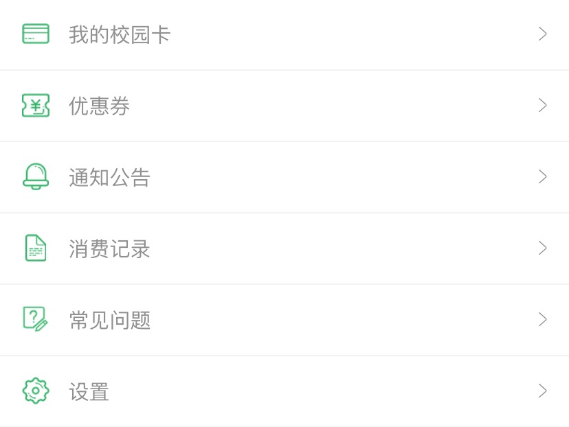
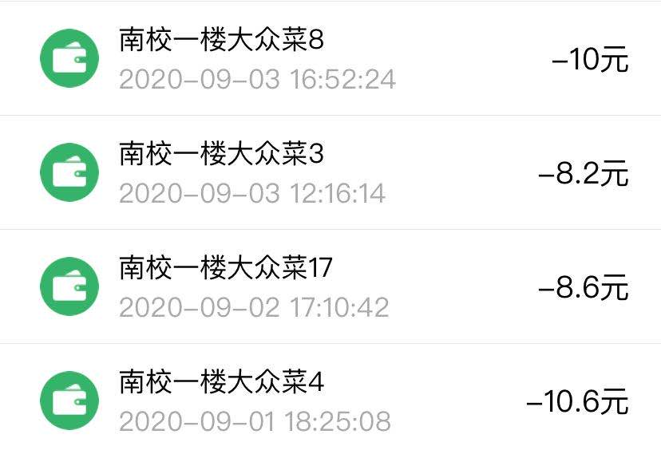
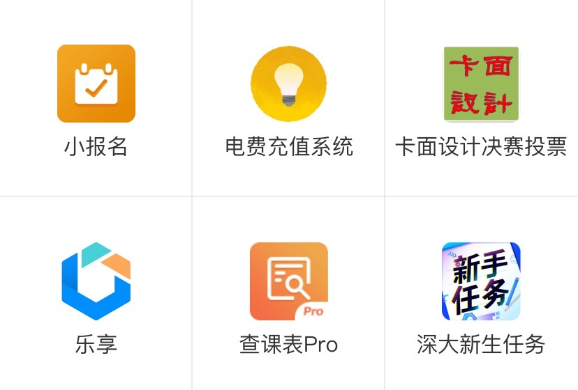

## 校园码介绍

校园码是深圳大学和腾讯微校合作的一款产品，可以在微信小程序搜索 `深大校园码` 进入小程序，如果还没有领取自己的校园码的话也可以直接搜索然后进去领取（需要输入校园卡号以及密码来验证自己的身份）

>  腾讯微校和很多学校都有过合作开发电子校园码，功能应该都差不多，因此并不是什么稀奇事，并且深圳大学引入电子校园码的时间挺晚的，在智慧校园这一块做的还是挺不够的

## 功能

### 1. 日常消费

如果验证过校园码之后，直接进入小程序就会显示校园码，可以用于食堂打饭及饮料，校巴等领域。付款方式默认是学生身份绑定的银行卡（学校发的那张），如果中行卡里面没钱就会扣微信里的钱。扣款顺序可以自行更改。

> 微信校园卡暂时不能用于身份验证，身份验证仍需实体校园卡

进入校园码小程序点击左上角可以进入个人中心，在个人中心可以查看到校园码的消费记录（何时何地消费多少钱）

### 2. 充值电费

在个人中心点击 `我的校园卡` 里面会有很多应用，当然，截至目前并没有很多，以后可能会越来越多，可以看到有个 `电费充值系统` 的选项。进去先绑定好自己的房间，如果之前有人通过校园码为寝室充电费的话都可以被查询到。绑定好房间后直接就可以为寝室充值电费了，一般五分钟之内就会到账。

> 这里只能够看到充值的数额，并不能看到寝室还剩多少电。

