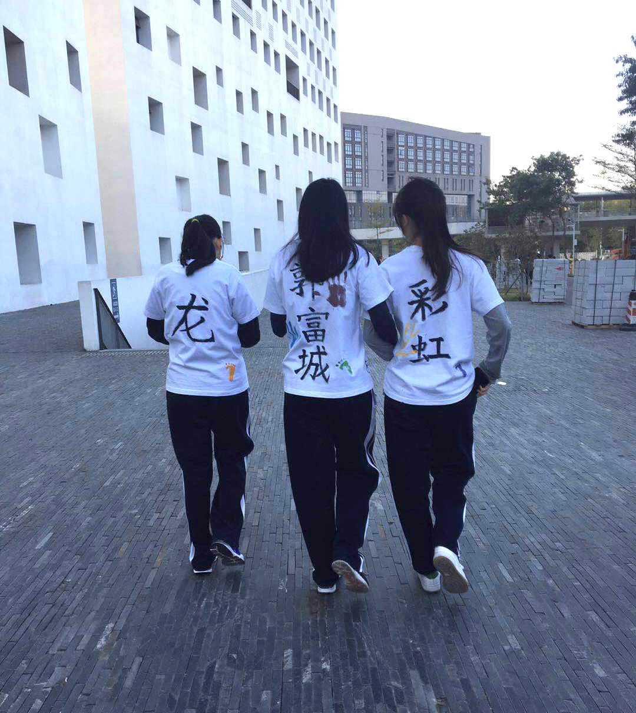
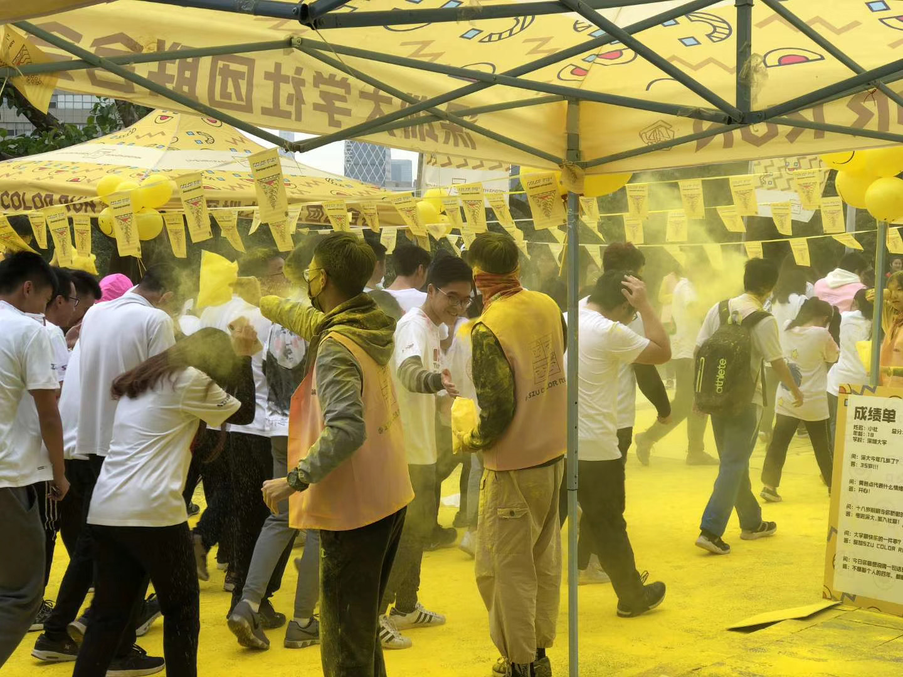

## 彩色跑

深圳大学彩色跑是每年举行一次的活动，届时同学们穿着自己涂鸦的衣服环校跑一圈，一般彩色跑随着校运会开幕式结束后就开始。各学院会在彩色跑前几天发放彩色跑服装，同学们可以在衣服上自由涂鸦。

彩色跑途中会经过很多关卡，关卡处会有工作人员在那里用彩色的玉米粉对路过的同学进行抛撒，这种粉末对人和环境无害。每年的彩色跑都有很多同学参加，常常使得彩色跑衣服供不应求，因此想要参与的同学得尽早报名彩色跑，否则只能穿着自己的衣服去彩色跑。

